# ☁️ Azure Infrastructure Lab

<p align="left">
  
  
  
  
  
</p>

> **Hands-on Azure infrastructure project** demonstrating private networking, Windows Server administration, SQL Server, Azure Files, NSG security controls, PowerShell validation, and cost-aware cloud operations.

## 🎯 Project Summary

This repository demonstrates a working two-server Azure environment built for the fictional company **Sweditech AB**. The goal was to design, deploy, secure, and validate a small backend infrastructure where administration is separated from the SQL workload and server-to-server communication remains on the private Azure network.

### Key outcomes

- Deployed and configured **two Windows Server VMs** in Microsoft Azure
- Designed a **VNet and dedicated server subnet**
- Kept the **SQL Server VM private with no public IP**
- Restricted SQL traffic using an **Azure NSG and Windows Firewall**
- Validated TCP 1433 connectivity using **PowerShell**
- Installed **SQL Server 2025 Developer** and managed it remotely with **SSMS**
- Implemented **Azure Files** shared storage across both servers
- Applied basic **cost-management controls** such as auto-shutdown and VM deallocation

## 🧰 Technology Stack

`Azure` · `Windows Server 2022` · `Azure Virtual Network` · `NSG` · `Azure Files` · `SQL Server 2025` · `SSMS` · `PowerShell` · `Windows Firewall` · `RDP`

---

## Project Overview

This project documents the practical implementation of a small Azure infrastructure environment for the fictional company **Sweditech AB**.

The environment was designed to separate administration from the database workload while keeping backend communication on a private Azure network. The lab also includes shared storage, network security controls, connectivity testing, and basic cost-management measures.

## 🏗️ Architecture

```text
                         Internet
                            |
                    Restricted RDP access
                            |
                            v
                  +-------------------+
                  | Sweditech-VM01    |
                  | Administration    |
                  | Windows Server    |
                  | SSMS              |
                  | 10.0.1.4          |
                  +---------+---------+
                            |
                Private Azure network
                 RDP / SQL TCP 1433
                            |
                            v
                  +-------------------+
                  | Sweditech-VM02    |
                  | SQL Server        |
                  | Windows Server    |
                  | 10.0.1.5          |
                  | No public IP      |
                  +-------------------+

              Sweditech-VNET-BE: 10.0.0.0/16
                  Server-Subnet: 10.0.1.0/24

                            |
                            v
                      Azure Files
                    sweditech-share
                      VM01 <-> VM02
```

## 🌐 Network Design

The environment uses **Sweditech-VNET-BE** with the address space `10.0.0.0/16`.

A dedicated server subnet was created:

```text
Server-Subnet
10.0.1.0/24
```

Both virtual machines are connected to this subnet.

| Server | Role | Private IP | Public exposure |
|---|---|---:|---|
| Sweditech-VM01 | Administration / SSMS | 10.0.1.4 | RDP access restricted |
| Sweditech-VM02 | SQL Server | 10.0.1.5 | No public IP |

The SQL server is intentionally kept private. Administration and SQL connectivity to VM02 are performed through the internal Azure network.

## 🖥️ Virtual Machines

### Sweditech-VM01 — Administration Server

VM01 is the administration machine for the environment.

It is used to:

- administer the backend environment
- connect to VM02 through its private IP address
- run SQL Server Management Studio
- test network connectivity
- access the shared Azure Files storage

RDP access to VM01 is restricted rather than exposed to the entire internet.

### Deployment evidence

The Azure portal overview below shows the administration VM and its placement in the Sweditech resource group and virtual network.

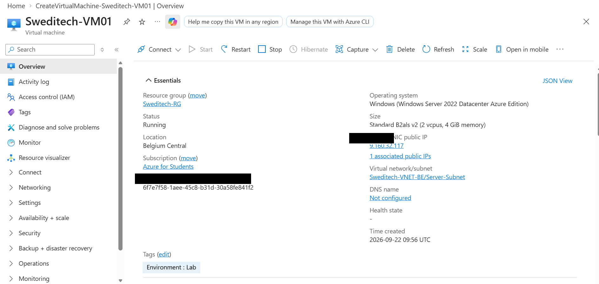

Both Windows Server virtual machines were deployed in Azure, with VM01 acting as the administration server and VM02 hosting the SQL workload.

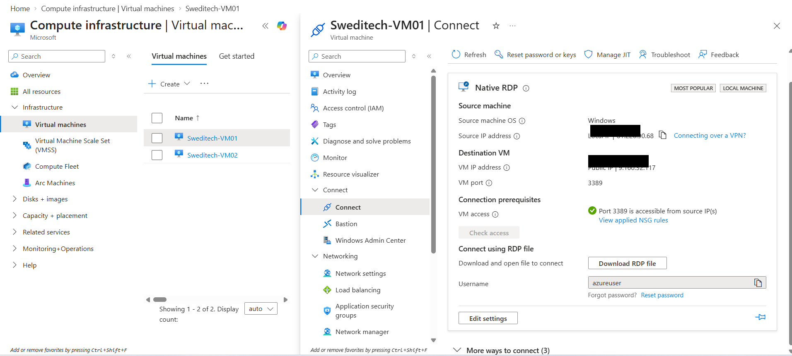

### Sweditech-VM02 — SQL Server

VM02 hosts the database workload.

SQL Server 2025 Developer was installed with **Database Engine Services** and configured as the default `MSSQLSERVER` instance.

TCP/IP was enabled and SQL Server was configured to listen on:

```text
TCP 1433
```

VM02 does not require a public IP because SQL traffic is handled internally.

The network configuration confirms that VM02 is connected to the private server subnet without a public IP.

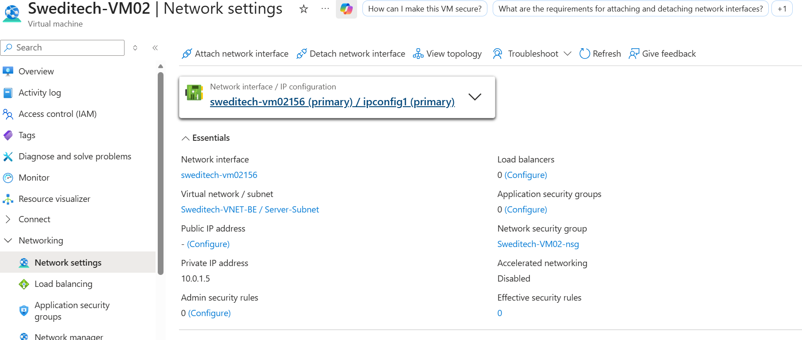

Administration of VM02 was performed from VM01 using the private address `10.0.1.5`, demonstrating private VM-to-VM management inside the VNet.

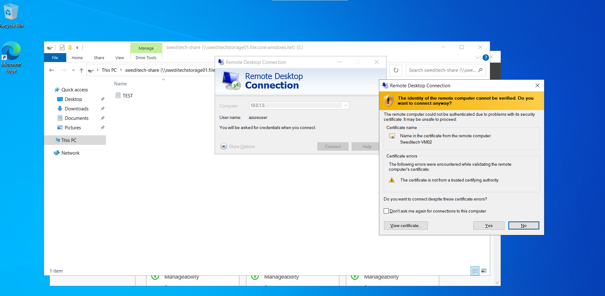

## 🔐 Network Security

A Network Security Group rule was configured to allow SQL traffic only from the server subnet:

```text
Source:      10.0.1.0/24
Protocol:    TCP
Port:        1433
Action:      Allow
Priority:    110
Rule name:   Allow-SQL-1433-Internal
```

Windows Defender Firewall on VM02 was also configured with an inbound rule for TCP 1433.

This creates two layers of traffic control: Azure NSG filtering and the Windows host firewall.

The Azure NSG rule below shows TCP 1433 restricted to the internal `10.0.1.0/24` server subnet.

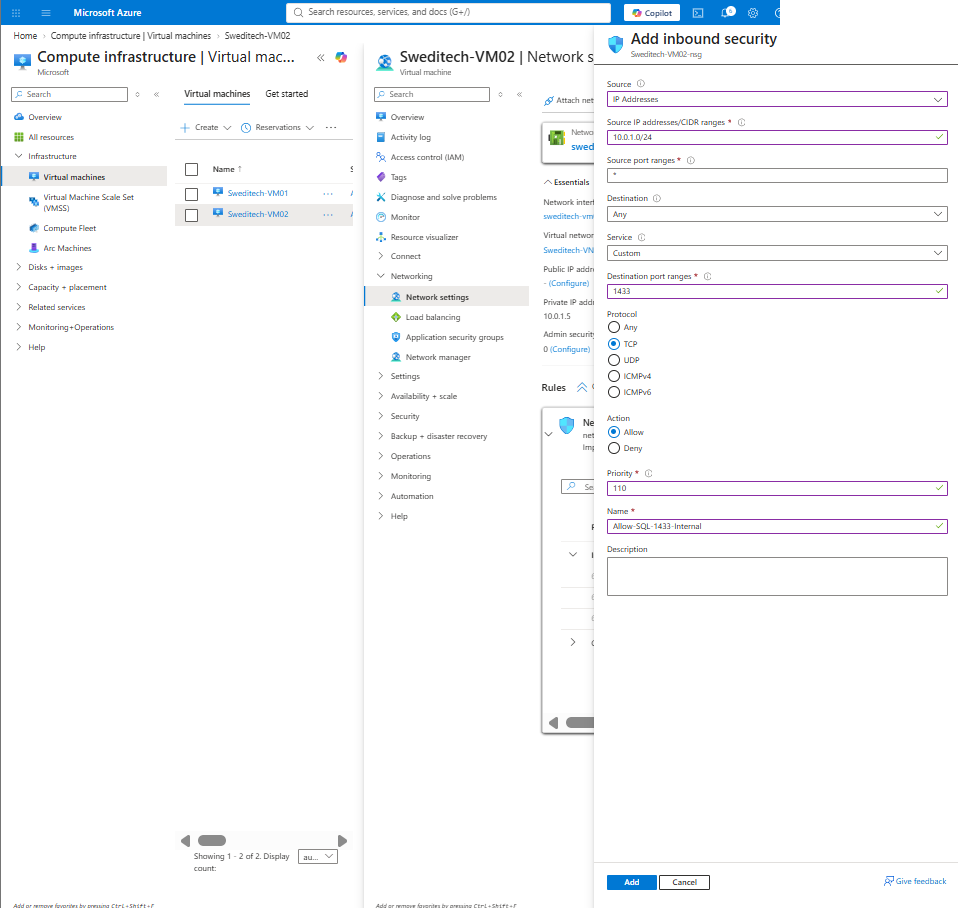

## 🧪 Connectivity Validation

Connectivity from VM01 to the SQL server was tested with PowerShell:

```powershell
Test-NetConnection 10.0.1.5 -Port 1433
```

The test returned:

```text
RemoteAddress    : 10.0.1.5
RemotePort       : 1433
SourceAddress    : 10.0.1.4
TcpTestSucceeded : True
```

This verified that TCP 1433 was reachable from the administration server to the SQL server over the private network.

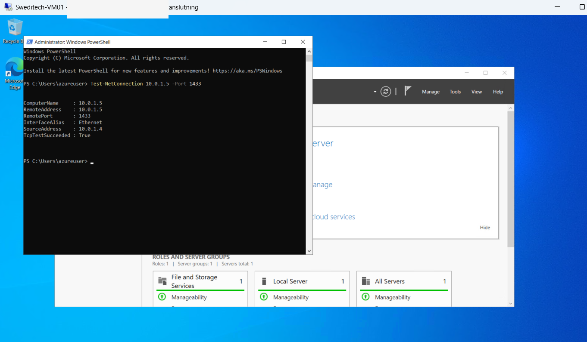

## 🗄️ SQL Server and Database

SQL Server Management Studio was installed on VM01 and used to connect to:

```text
10.0.1.5,1433
```

After validating the connection, a database named **SweditechDB** was created.

This demonstrated that the administration VM could successfully reach and manage the SQL Server workload without exposing SQL Server directly to the internet.

SQL Server Database Engine Services were installed successfully on VM02.

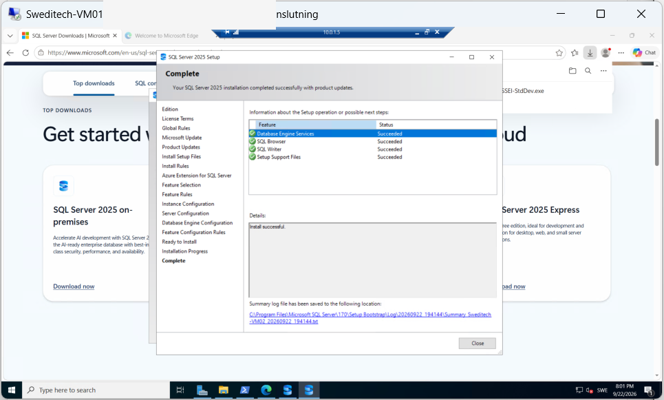

SSMS on VM01 was then used to establish a working connection to the SQL Server instance over the private network.

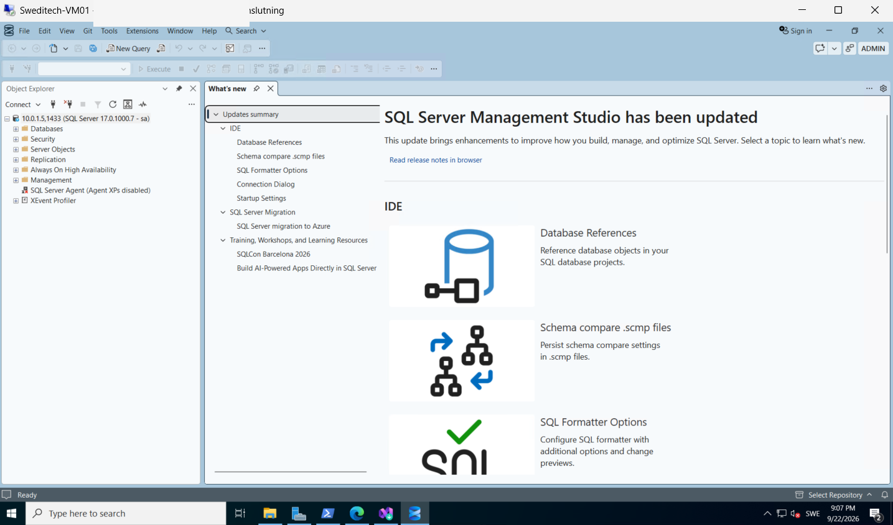

Finally, **SweditechDB** was created and verified in SQL Server Management Studio.

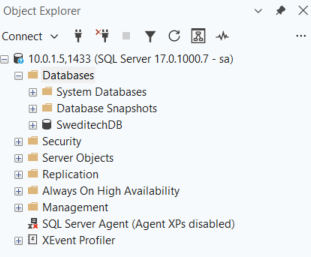

## 📁 Azure Files

A Storage Account and Azure file share named **sweditech-share** were created to provide shared storage.

The file share was mounted on both VM01 and VM02.

A test file created from VM01 was successfully accessed from VM02, verifying that both machines could use the same shared Azure storage.

The Azure file share was created in the storage account:

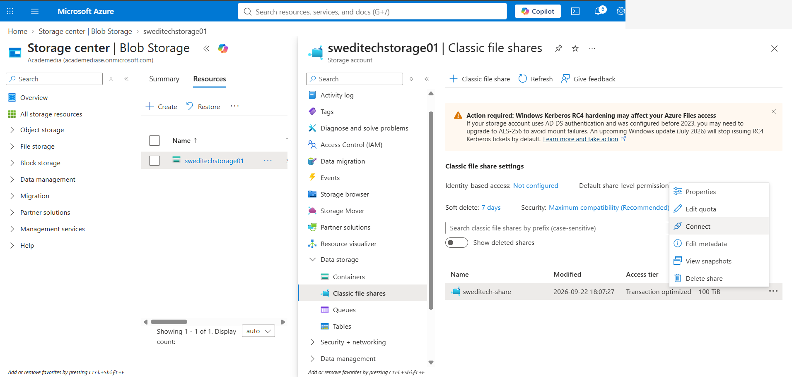

The share was mounted on VM01 as a network drive:

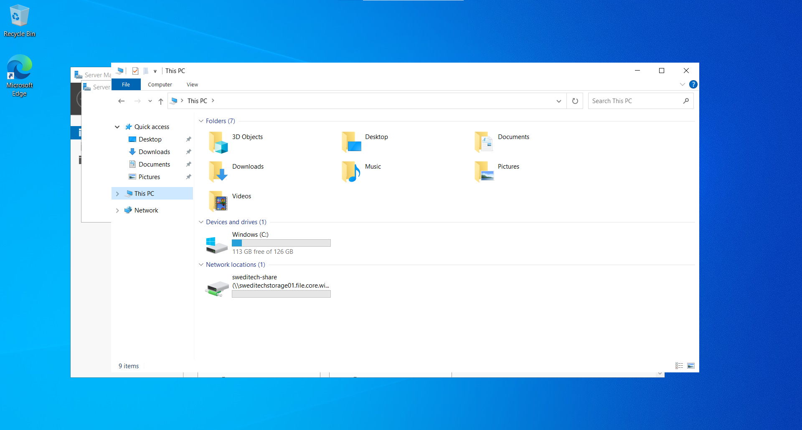

The same test file was then visible from VM02, validating shared access between the two servers:

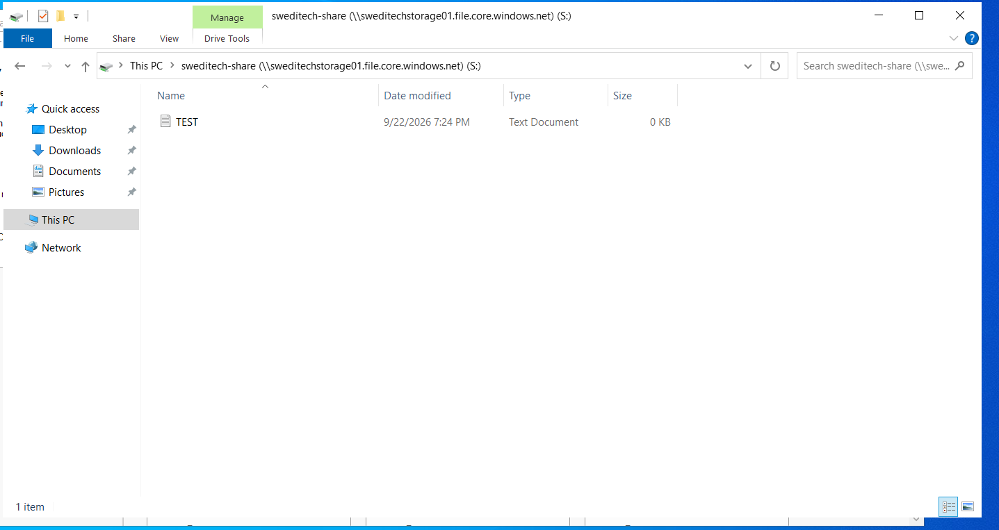

## 💰 Cost Management

The lab includes basic cost-control measures:

- smaller VM sizes were selected where available
- Standard SSD storage was used
- auto-shutdown was enabled for VM01
- virtual machines are stopped/deallocated when the lab is not in use

## 🛡️ Security Considerations

The implementation follows several basic security principles:

- SQL Server is not directly exposed through a public IP
- SQL traffic is limited to the internal server subnet
- RDP access is restricted
- Azure NSG rules and Windows Firewall are both used
- passwords, storage keys, tokens, connection strings, and other secrets are excluded from documentation
- unnecessary public exposure is avoided

## ✅ Validation Checklist

The completed implementation verifies:

- Azure resource group created
- VNet and server subnet configured
- two Windows Server VMs deployed
- private VM-to-VM connectivity working
- internal SQL TCP 1433 rule configured
- SQL Server installed and running
- PowerShell connectivity test successful
- Azure Files mounted on both servers
- shared file access validated
- SSMS connection from VM01 to VM02 successful
- SweditechDB created successfully

## 📚 What I Learned

This lab provided hands-on experience with how Azure infrastructure components work together rather than treating each service in isolation.

Key areas practiced included:

- designing Azure virtual networking
- separating administrative and server workloads
- reducing unnecessary public exposure
- configuring NSGs and Windows Firewall
- troubleshooting and validating TCP connectivity
- deploying and configuring SQL Server
- working with shared Azure storage
- connecting infrastructure services across a private network
- considering cloud resource costs during implementation

## 🚧 Project Status

**In progress.**

This repository currently documents the completed practical Azure implementation. Additional Cloud Services work will be added as the project progresses.

---

*Built as a hands-on cloud and infrastructure lab for portfolio and learning purposes.*
